<div align="center">

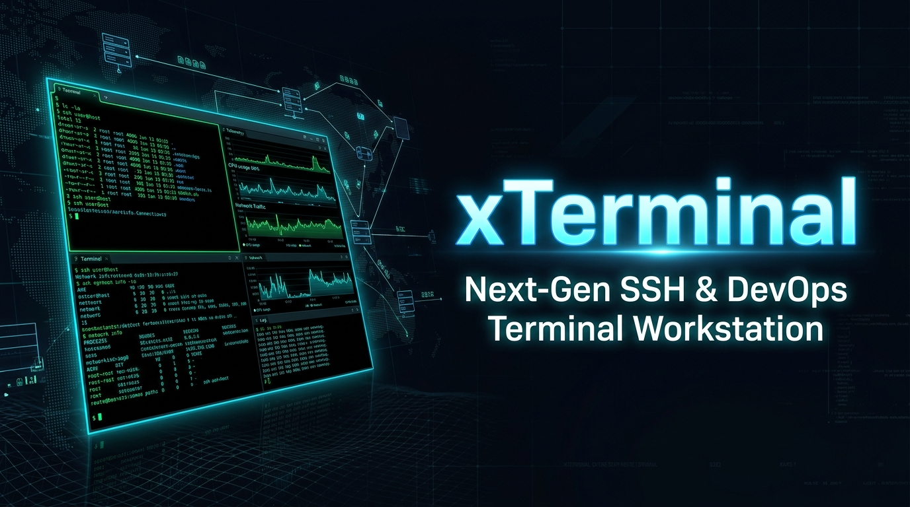


# ⚡ xTerminal
### Next-Generation Multi-Protocol SSH, Telnet, Serial, Android ADB & DevOps Workstation
**Enterprise Remote Access, Cloud Infrastructure & Network Engineering Suite**

<p align="center">
  <a href="https://github.com/lyarinet/xTerminal-Next-Gen-SSH-Network-Terminal/releases/latest">
    
  </a>
  <a href="https://snapcraft.io/xterminal">
    
  </a>
  <a href="https://copr.fedorainfracloud.org/coprs/asifagaria/xterminal/">
    
  </a>
  <a href="https://apps.microsoft.com/">
    
  </a>
  <a href="https://play.google.com/store/apps/details?id=com.lyarinet.xterminal">
    
  </a>
  <a href="https://github.com/lyarinet/xTerminal-Next-Gen-SSH-Network-Terminal/stargazers">
    
  </a>
  <a href="https://github.com/lyarinet/xTerminal-Next-Gen-SSH-Network-Terminal/network/members">
    
  </a>
  <a href="LICENSE">
    
  </a>
</p>

<p align="center">
  
  
  
  
  
  
</p>

<p align="center">
  <b>A blazing-fast, modern, privacy-focused terminal workstation built for DevOps engineers, cloud architects, sysadmins, and network professionals.</b><br />
  Native cross-platform execution on <b>Windows</b>, <b>Linux</b>, <b>macOS</b>, and <b>Android</b> with zero external server dependencies.
</p>

### 📥 One-Click Official Downloads

<p align="center">
  <a href="https://github.com/lyarinet/xTerminal-Next-Gen-SSH-Network-Terminal/releases/download/v1.2.8/xTerminal.Setup.1.2.8.exe">
    
  </a>
  <a href="https://github.com/lyarinet/xTerminal-Next-Gen-SSH-Network-Terminal/releases/download/v1.2.8/xterminal_1.2.8_amd64.deb">
    
  </a>
  <a href="https://github.com/lyarinet/xTerminal-Next-Gen-SSH-Network-Terminal/releases/download/v1.2.8/xTerminal-1.2.8.AppImage">
    
  </a>
  <a href="https://github.com/lyarinet/xTerminal-Next-Gen-SSH-Network-Terminal/releases/download/v1.2.8/xterminal-1.2.8.x86_64.rpm">
    
  </a>
  <a href="https://github.com/lyarinet/xTerminal-Next-Gen-SSH-Network-Terminal/releases/download/v1.2.8/xTerminal-1.2.8-arm64.dmg">
    
  </a>
  <a href="https://github.com/lyarinet/xTerminal-Next-Gen-SSH-Network-Terminal/releases/download/v1.2.8/xTerminal-1.2.8.apk">
    
  </a>
  <a href="https://snapcraft.io/xterminal">
    
  </a>
</p>

[ 🚀 Features ](#-key-features) &nbsp;•&nbsp;
[ 🥊 Why xTerminal? ](#-feature-comparison--why-xterminal) &nbsp;•&nbsp;
[ 🏗️ Architecture ](#️-architecture-overview) &nbsp;•&nbsp;
[ 📸 Visual Tour ](#-visual-showcase--feature-tour) &nbsp;•&nbsp;
[ 📥 Downloads ](#-downloads--installation-matrix) &nbsp;•&nbsp;
[ ⚡ Quick Start ](#-quick-start--fresh-pc-setup) &nbsp;•&nbsp;
[ 🤝 Contributing ](#-contributing)

<br />

---

### 🖥️ Full-Duplex Terminal Workspace & Local PTY
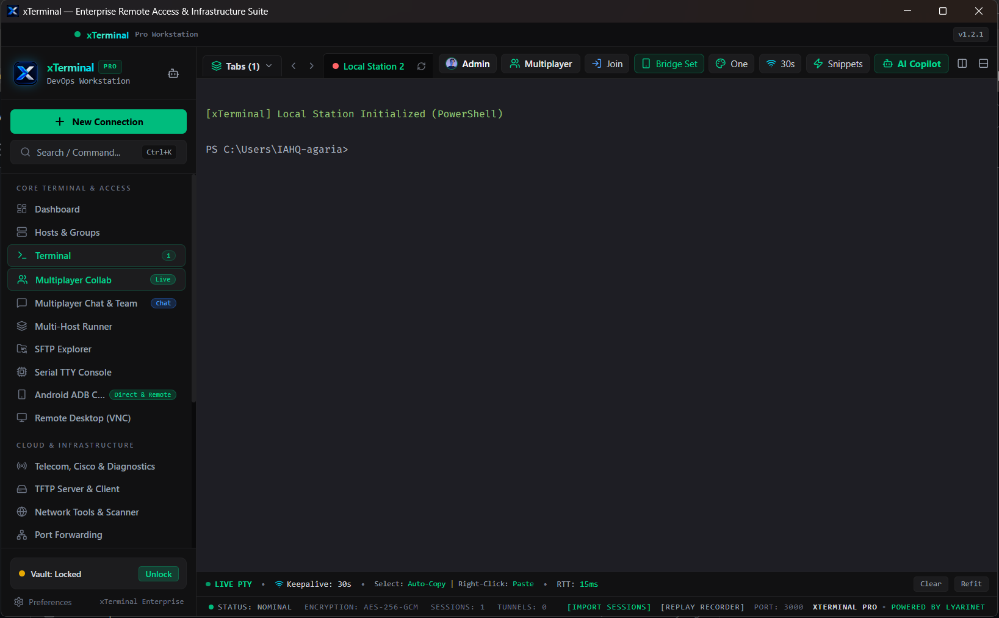
<p align="center"><em>Persistent session engine, multi-tab split panes, live keepalive monitoring, and custom high-contrast themes.</em></p>

</div>

---

> [!TIP]
> **Zero Reconnect on Tab Navigation:** In xTerminal, terminal sessions stay persistently mounted in background memory and the DOM. Switching between tabs or navigating across views (Hosts, SFTP, Vault, Settings) **never drops your active connection**.

---

## 🥊 Feature Comparison — Why xTerminal?

| Feature | ⚡ xTerminal | 🐢 PuTTY | 🔒 Termius | 📦 MobaXterm |
| :--- | :---: | :---: | :---: | :---: |
| **Open Source & 100% Free** | 🟢 **Yes (MIT)** | 🟢 Yes | 🔴 Paid / Freemium | 🔴 Proprietary |
| **Cross-Platform (Win, Linux, Mac, Android)** | 🟢 **All 4 Platforms** | 🔴 Windows Only | 🟢 Yes | 🔴 Windows Only |
| **Real-Time Multiplayer Team Sharing** | 🟢 **Built-in Live Relay** | 🔴 No | 🔴 Team Plan ($$$) | 🔴 No |
| **Multi-Host Command Orchestrator** | 🟢 **Parallel Execution** | 🔴 No | 🔴 No | 🟡 Basic Multi-Exec |
| **Zero-Install Remote Serial Bridge** | 🟢 **WebSerial over IP** | 🔴 No | 🔴 No | 🔴 No |
| **Integrated Android ADB Console** | 🟢 **USB + Wi-Fi + Logcat**| 🔴 No | 🔴 No | 🔴 No |
| **Native TFTP Server & Client** | 🟢 **RFC 1350 / 2348** | 🔴 No | 🔴 No | 🟡 Windows Only |
| **Embedded VNC Remote Desktop** | 🟢 **Direct Canvas noVNC** | 🔴 No | 🔴 No | 🟡 Windows Only |
| **Session Recording & Asciinema Replay** | 🟢 **Built-in Player** | 🟡 Plain Text Log | 🔴 No | 🔴 No |
| **Zero Cloud Telemetry / Encrypted Vault** | 🟢 **AES-256 Local** | 🟡 Registry | 🔴 Mandatory Cloud | 🟡 Registry/INI |

---

## 🏗️ Architecture Overview

xTerminal is engineered to operate completely standalone without requiring external cloud servers, Docker containers, websockify proxies, or complex daemons:

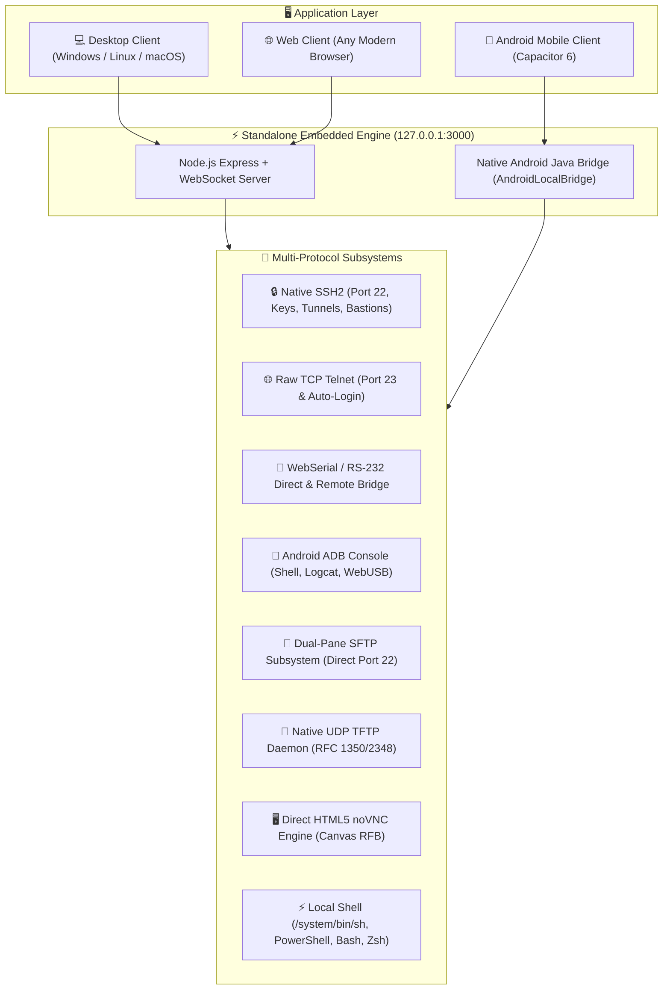
```mermaid
graph TD
    subgraph UI_Layer ["🖥️ Application Layer"]
        Electron["💻 Desktop Client (Windows / Linux / macOS)"]
        Capacitor["📱 Android Mobile Client (Capacitor 6)"]
        Browser["🌐 Web Client (Any Modern Browser)"]
    end

    subgraph Core_Bridge ["⚡ Standalone Embedded Engine (127.0.0.1:3000)"]
        DesktopEngine["Node.js Express + WebSocket Server"]
        MobileEngine["Native Android Java Bridge (AndroidLocalBridge)"]
    end

    subgraph Protocols ["🔌 Multi-Protocol Subsystems"]
        SSH["🔒 Native SSH2 (Port 22, Keys, Tunnels, Bastions)"]
        Telnet["🌐 Raw TCP Telnet (Port 23 & Auto-Login)"]
        Serial["🔌 WebSerial / RS-232 Direct & Remote Bridge"]
        ADB["🤖 Android ADB Console (Shell, Logcat, WebUSB)"]
        SFTP["📁 Dual-Pane SFTP Subsystem (Direct Port 22)"]
        TFTP["📡 Native UDP TFTP Daemon (RFC 1350/2348)"]
        VNC["🖥️ Direct HTML5 noVNC Engine (Canvas RFB)"]
        LocalPTY["⚡ Local Shell (/system/bin/sh, PowerShell, Bash, Zsh)"]
    end

    Electron --> DesktopEngine
    Browser --> DesktopEngine
    Capacitor --> MobileEngine

    DesktopEngine --> Protocols
    MobileEngine --> Protocols
```

---

## 📸 Visual Showcase & Feature Tour

<div align="center">

### 📊 Real-Time Telemetry & Hardware Health Dashboard
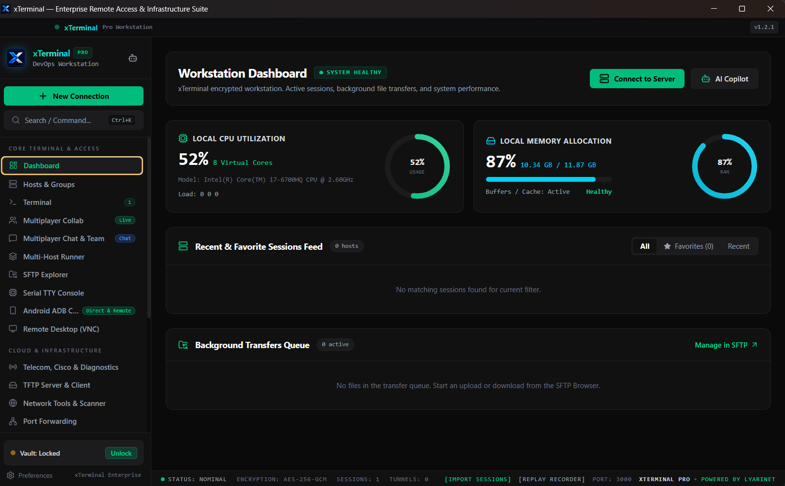
<p align="center"><em>Hardware telemetry, active sessions feed, bandwidth activity, and background SFTP queues.</em></p>

---

### 🌐 Multi-Host Command Orchestrator & Parallel Runner
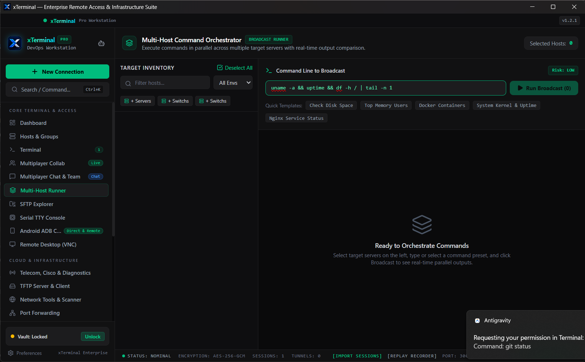
<p align="center"><em>Execute shell commands simultaneously across infrastructure nodes with safety risk evaluation and synchronized diff view.</em></p>

---

### 👥 Real-Time Multiplayer Collaboration & Team Terminals
| Session Sharing & Control Governance | Live Presence Drawer & Team Chat |
| :---: | :---: |
| 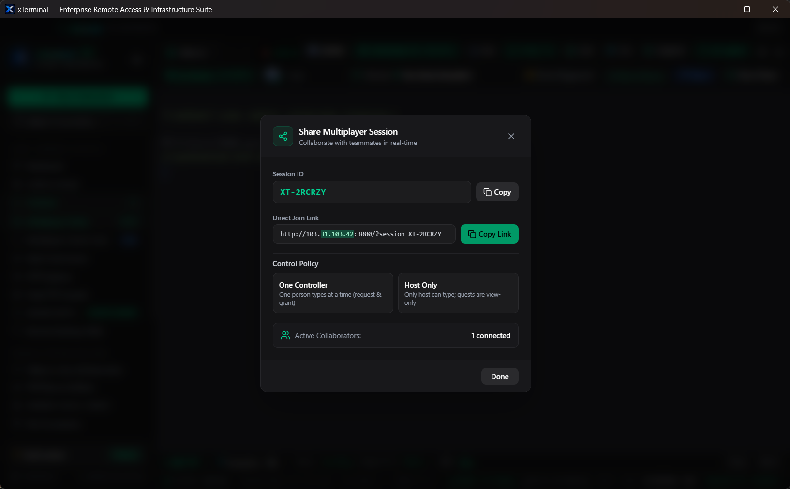 | 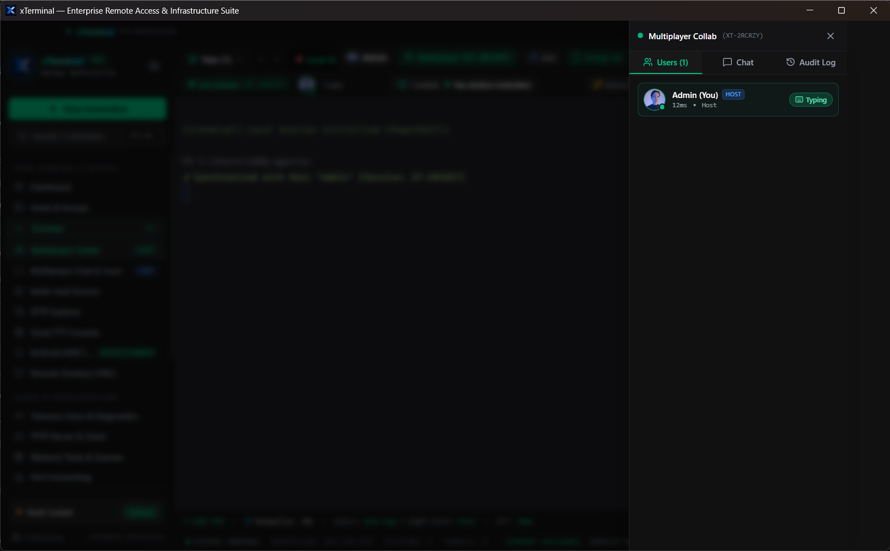 |
| *Share secure link with Read-Only or Interactive mode* | *Live participant list, typing indicators & real-time chat* |

---

### 🔄 Universal Bookmark & Connection Importer
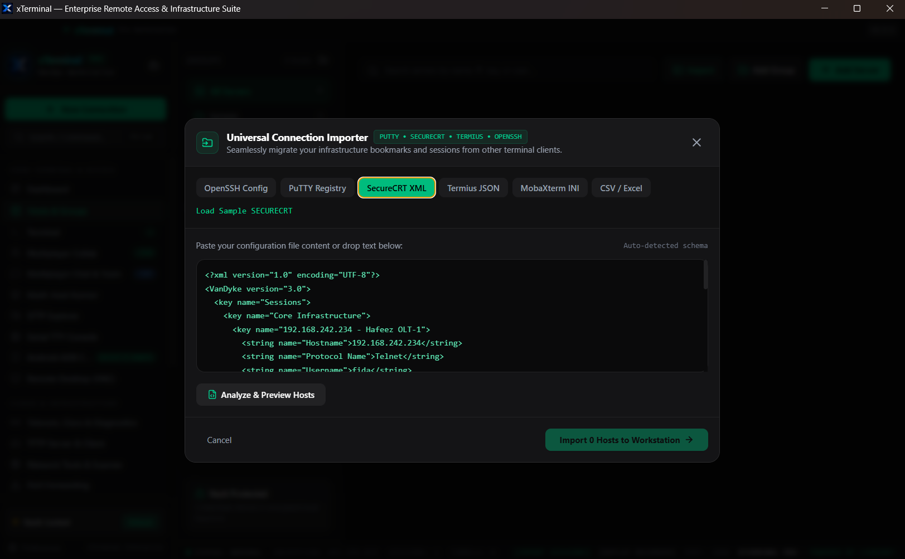
<p align="center"><em>One-click migration from PuTTY Registry, SecureCRT XML, Termius JSON, MobaXterm INI, OpenSSH Config, and CSV/Excel.</em></p>

---

### 🗂️ Advanced Host & Infrastructure Management
| Add New Server (SSH / Telnet) | Custom Host Groups & Color Badges |
| :---: | :---: |
| 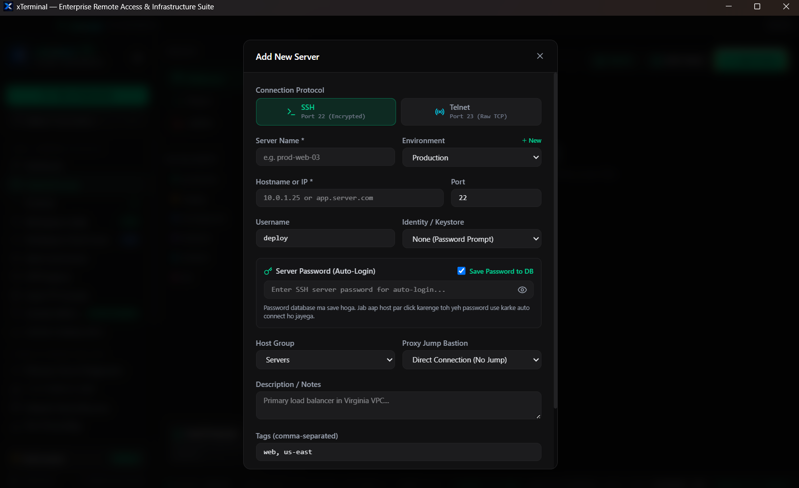 | 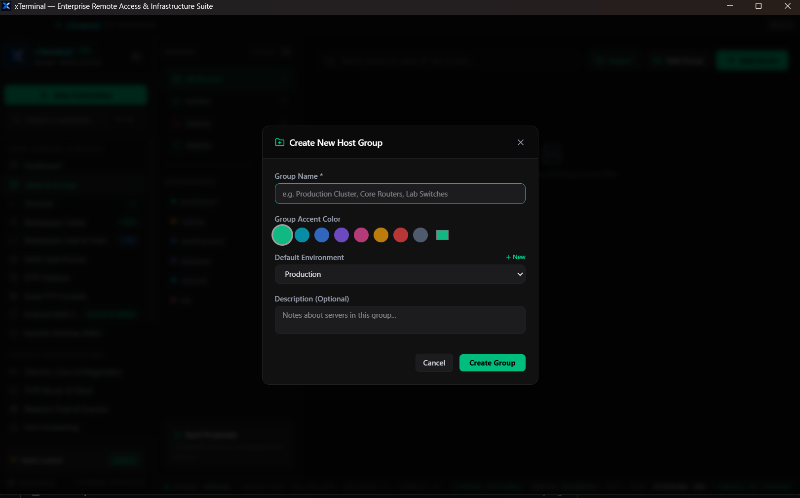 |
| *Encrypted password store, bastion jumps & key vault* | *Organize clusters with environments and tags* |

---

### 🔌 Zero-Install Remote Serial Bridge (WebSerial over IP)
| Remote Serial URL Generator | Active Session Waiting Portal |
| :---: | :---: |
| 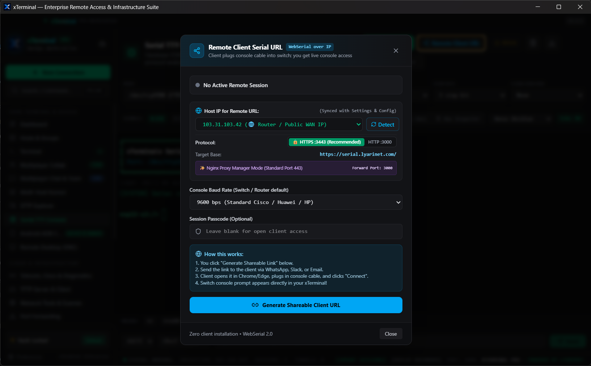 | 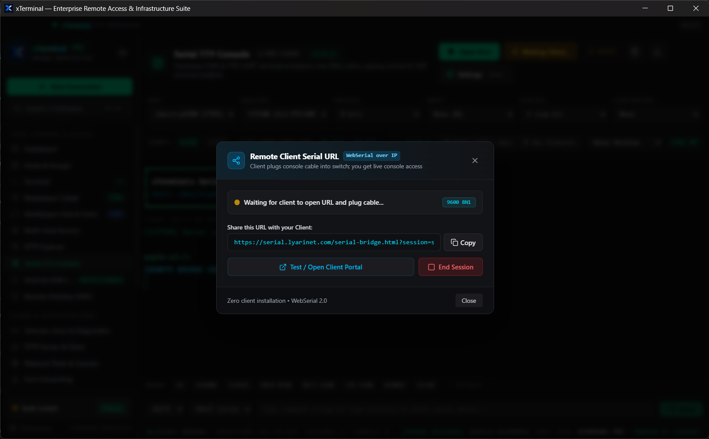 |
| *Auto-detects host IP and generates secure link* | *Client opens Chrome/Edge and plugs console cable* |

### 🌐 Client-Side Browser Serial Connection
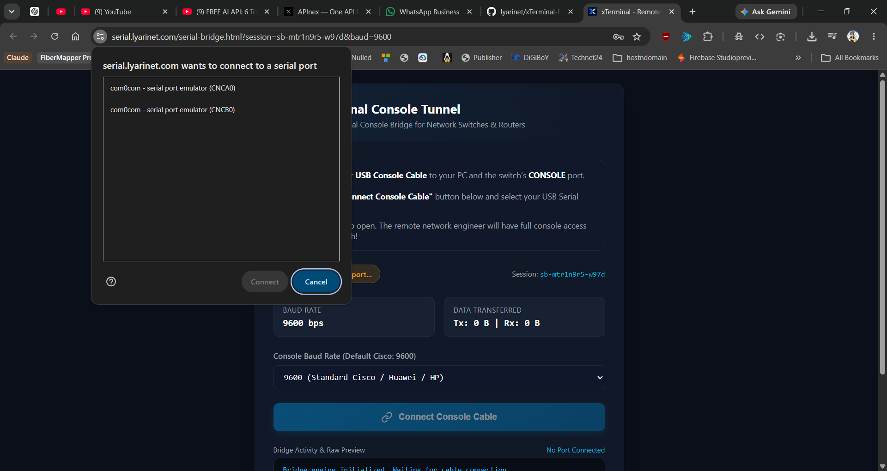
<p align="center"><em>Remote technician plugs their USB console cable into Chrome/Edge with zero software install and connects directly into your console.</em></p>

---

### 📁 Dual-Pane SFTP File Manager (Native SSH2 Engine)
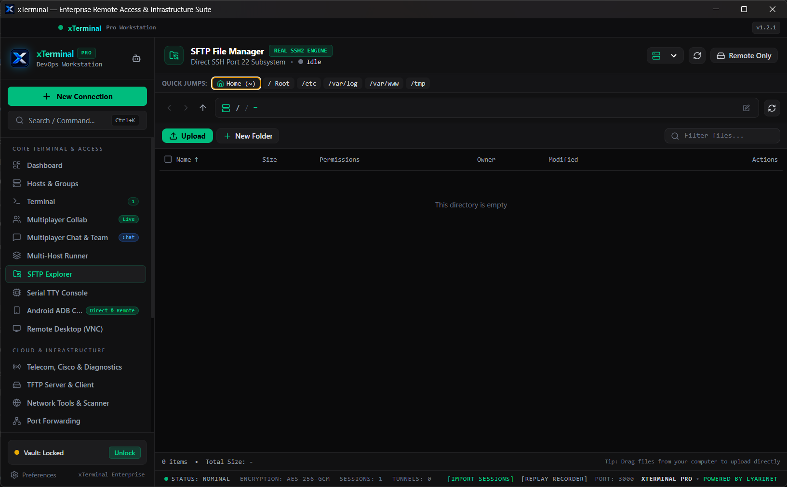
<p align="center"><em>Direct Port 22 SFTP Subsystem with directory quick-jumps, dual-pane layout, drag-and-drop, and resume queues.</em></p>

---

### 🤖 Android ADB Console & WebUSB Remote Bridge
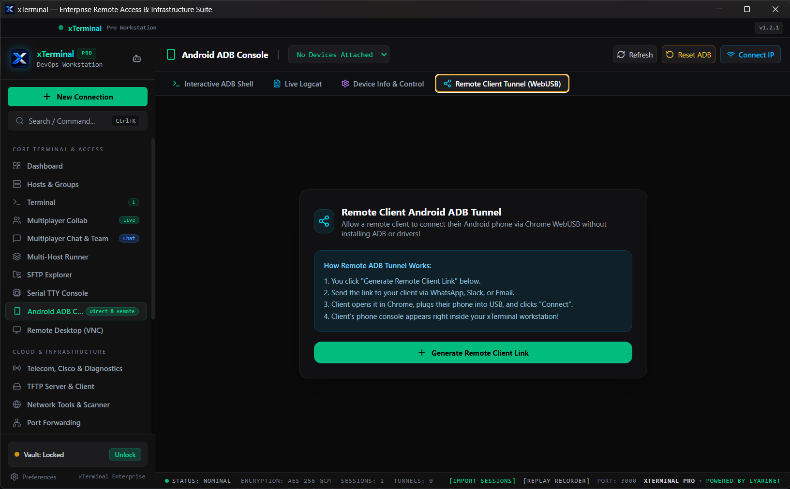
<p align="center"><em>Interactive ADB shell, live logcat streaming, hardware specs, Wi-Fi pairing, and remote WebUSB client bridge.</em></p>

---

### 📡 TFTP Server & Remote Transfer Client (RFC 1350 / 2348)
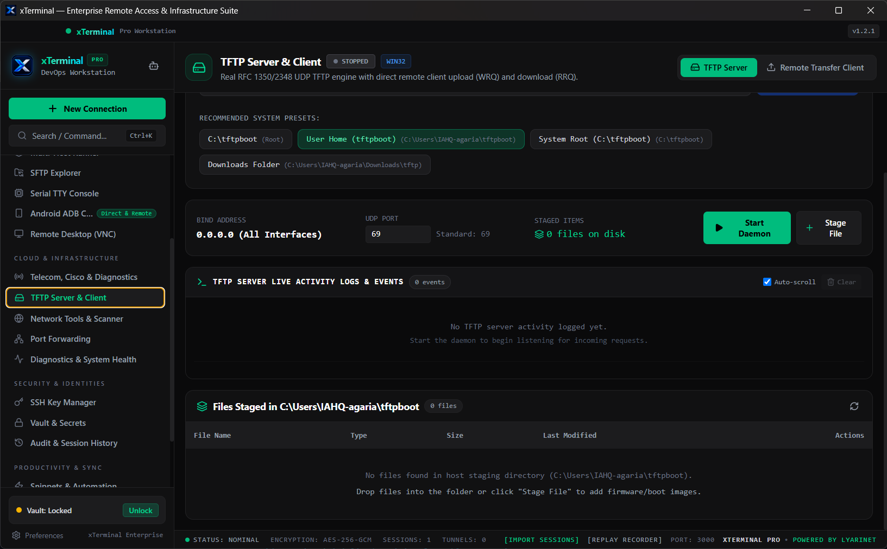
<p align="center"><em>Built-in UDP TFTP daemon for Cisco/MikroTik firmware staging, backups, and restores with live transfer metrics.</em></p>

---

### 🛠️ Network Diagnostics & Workstation Settings
| Port Scanner, Ping & Traceroute | Workstation Settings & Interface Discovery |
| :---: | :---: |
| 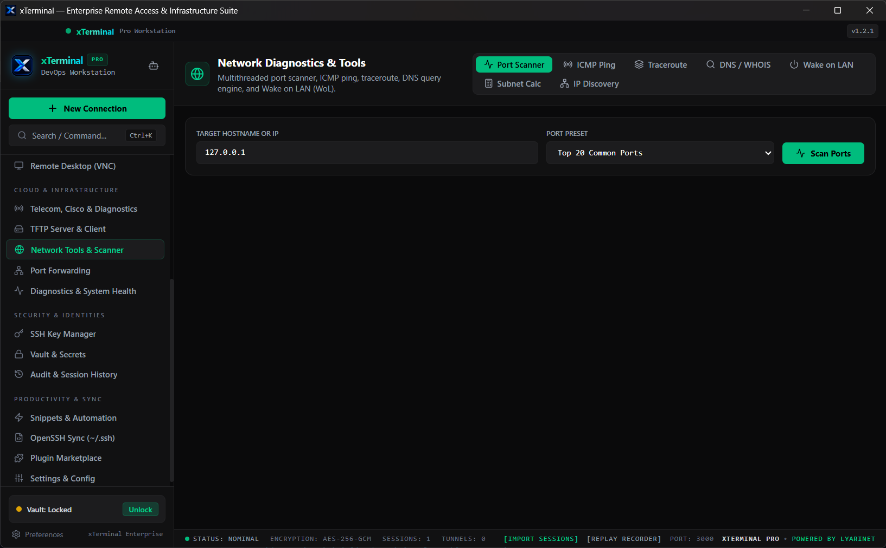 | 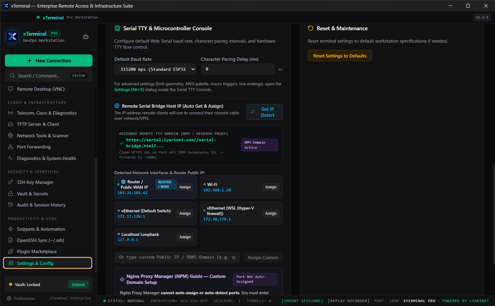 |
| *Multithreaded port scanner, ICMP ping, traceroute & WoL* | *Reverse proxy configs, auto TLS, and LAN/WAN interface detection* |

</div>

---

## 📥 Downloads & Installation Matrix

Download pre-compiled release artifacts from the official [**GitHub Releases Page**](https://github.com/lyarinet/xTerminal-Next-Gen-SSH-Network-Terminal/releases/latest).

| Platform | Package Format | Installation Command / Action |
| :--- | :--- | :--- |
| 🐧 **Linux (Ubuntu / Debian)** | `.deb` standalone | [**Download .deb**](https://github.com/lyarinet/xTerminal-Next-Gen-SSH-Network-Terminal/releases/download/v1.2.8/xterminal_1.2.8_amd64.deb) &nbsp; `sudo dpkg -i xterminal_1.2.8_amd64.deb` |
| 🐧 **Linux (Universal Portable)** | `.AppImage` | [**Download AppImage**](https://github.com/lyarinet/xTerminal-Next-Gen-SSH-Network-Terminal/releases/download/v1.2.8/xTerminal-1.2.8.AppImage) &nbsp; `chmod +x xTerminal-1.2.8.AppImage && ./xTerminal-1.2.8.AppImage` |
| 🐧 **Linux (Fedora / RHEL)** | `.rpm` standalone | [**Download .rpm**](https://github.com/lyarinet/xTerminal-Next-Gen-SSH-Network-Terminal/releases/download/v1.2.8/xterminal-1.2.8.x86_64.rpm) &nbsp; `sudo dnf install ./xterminal-1.2.8.x86_64.rpm` |
| 🐧 **Linux (Flatpak)** | Flatpak bundle | `flatpak install --user https://dl.flathub.org/build-repo/318238/com.lyarinet.xterminal.flatpakref` |
| 🐧 **Linux (Snap)** | Canonical Snap | `sudo snap install xterminal` |
| 🪟 **Windows (Installer)** | Setup `.exe` | [**Download Windows Setup (.exe)**](https://github.com/lyarinet/xTerminal-Next-Gen-SSH-Network-Terminal/releases/download/v1.2.8/xTerminal.Setup.1.2.8.exe) |
| 🪟 **Windows (Store)** | Microsoft Store AppX | [**Download .appx**](https://github.com/lyarinet/xTerminal-Next-Gen-SSH-Network-Terminal/releases/download/v1.2.8/xTerminal.1.2.8.appx) |
| 🍎 **macOS** | `.dmg` (Apple Silicon & Intel) | [**Download macOS (.dmg)**](https://github.com/lyarinet/xTerminal-Next-Gen-SSH-Network-Terminal/releases/download/v1.2.8/xTerminal-1.2.8-arm64.dmg) |
| 🤖 **Android (Direct APK)** | `.apk` standalone | [**Download APK (v1.2.8)**](https://github.com/lyarinet/xTerminal-Next-Gen-SSH-Network-Terminal/releases/download/v1.2.8/xTerminal-1.2.8.apk) |
| 🤖 **Android (Google Play)** | Official Play Store | [**Install from Google Play**](https://play.google.com/store/apps/details?id=com.lyarinet.xterminal) |

> [!NOTE]
> **Hardware & Serial Permissions for Linux Snap:**  
> To allow xTerminal to communicate with USB console cables and ADB hardware in Snap:
> ```bash
> sudo snap connect xterminal:serial-port
> sudo snap connect xterminal:raw-usb
> sudo snap connect xterminal:removable-media
> ```

---

## 🚀 Quick Start / Fresh PC Setup

xTerminal includes automated, zero-configuration setup scripts that detect system prerequisites, install missing toolchains, and launch the workstation with a single command.

### 🪟 Windows (One-Click Setup)
```powershell
powershell -ExecutionPolicy Bypass -File .\setup.ps1
```
*Auto-detects and installs Node.js LTS and Git via `winget` if missing, sets up `.env`, runs `npm install`, and verifies the build.*

### 🐧 Linux (Ubuntu, Debian, Fedora, Arch) & 🍎 macOS
```bash
chmod +x setup.sh && ./setup.sh
```
*Auto-detects your system package manager (`apt`, `dnf`, `pacman`, `brew`), installs build dependencies, and compiles the bundle.*

### 🌐 Universal Setup (Any OS with Node.js)
```bash
npm run setup
# or: node setup.cjs
```

---

## ✨ Comprehensive Features Breakdown

<details open>
<summary><b>🌐 Multi-Protocol Terminal & Communication Engine</b></summary>
<br />

- **Full-Duplex SSH Engine**: Powered by `ssh2` with support for password authentication, private keys (Ed25519, RSA, ECDSA), and interactive masked password prompts.
- **Real-Time Telnet Engine**: Native raw TCP Telnet client (Port 23 or custom) with auto-login detection (`login:`, `password:`) and terminal stream piping.
- **Local Station PTY**: Instant local terminal access (PowerShell on Windows, Bash/Zsh on Linux and macOS, `/system/bin/sh` on Android) with automatic user home directory detection.
- **Serial TTY & Microcontroller Console**: Local hardware serial communication via WebSerial API (COM / TTY ports, baud rates up to 921600, data bits, parity, stop bits, flow control, RTS/DTR pins, and 250ms Break signals).
- **TFTP Engine (Server & Client)**: Full RFC 1350 & RFC 2348 implementation for firmware image transfers, Cisco/MikroTik backup & restore, with configurable block sizes and live transfer speed metrics.
</details>

<details>
<summary><b>🎥 Terminal Session Recording & Asciinema v2 Replay</b></summary>
<br />

- **1-Click Live Recording**: Top toolbar record button with live timer (`REC 0:14`) captures all user keystrokes and server outputs with millisecond precision.
- **Interactive Player & Saved Library**: Dedicated modal with timeline scrubber, playback speeds (`1x`, `2x`, `4x`), restart, and terminal text search.
- **Asciinema v2 Support**: Export and import standard `.cast` session files for team audits, documentation, and training walkthroughs.
</details>

<details>
<summary><b>👥 Real-Time Multiplayer Collaboration & Team Terminals</b></summary>
<br />

- **Real-Time Multi-User Collaboration**: Multiple engineers join the same SSH, Telnet, or Local terminal session in real time with synchronized output and ordered keystroke processing.
- **Active Tab Participant Stack**: Circular participant avatar stack displayed right on the active terminal tab with latency indicators and active remote control keyboard badges.
- **Floating Cursor Presence Marker**: Dynamic rounded avatar badge indicating exactly where a teammate is typing in real time.
- **Terminal Control System**: Single-controller arbitration by default with "Request Control", host approval/denial prompts, and instant host "Take Control" override.
</details>

<details>
<summary><b>🖥️ Embedded VNC Remote Desktop (noVNC)</b></summary>
<br />

- **Zero-External-Server noVNC Engine**: Built-in HTML5 Canvas RFB client powered by `@novnc/novnc` and an embedded Node.js TCP-to-WebSocket bridge (`/ws/vnc`). Connect directly to any Linux, macOS, or Windows VNC server (Port 5900) with zero external servers, Docker containers, websockify, or Guacamole daemons!
- **Ctrl+Alt+Del & Clipboard Sync**: One-click key sequence injection and bidirectional clipboard synchronization.
</details>

<details>
<summary><b>🛡️ Safety Engine & Encrypted Security Vault</b></summary>
<br />

- **Command Risk Analyzer**: Pre-evaluates terminal commands and highlights risk levels (`SAFE`, `LOW`, `MEDIUM`, `HIGH`, `CRITICAL`).
- **Encrypted Local Vault**: AES-256 encrypted credential vault with auto-lock timer and clipboard timeout.
- **Audit Logging**: Comprehensive security audit trail of all sessions, connections, and executed commands.
</details>

---

## ⌨️ Global Keyboard Shortcuts

| Shortcut | Action |
| :--- | :--- |
| `Ctrl + K` / `Cmd + K` | Open Universal Command Palette |
| `Ctrl + T` / `Cmd + T` | Open New Local Terminal Tab |
| `Alt + S` | Open Serial Terminal Configuration Modal |
| `Mouse Select` | Auto-copy selected text to clipboard |
| `Right Click` | Paste clipboard text into terminal |
| `Ctrl + C` | Send SIGINT / interrupt process |

---

## 🛠️ Tech Stack & Dependencies

```
xTerminal Core Stack
 ├── UI Framework: React 19, TypeScript 5.8, Tailwind CSS 3.4
 ├── Terminal Emulation: xterm.js 5.5, xterm-addon-fit, xterm-addon-search
 ├── Native Desktop: Electron 44, Node.js 22, Express, ws
 ├── Mobile Engine: Capacitor 6, Android SDK, Standalone Java Bridge
 ├── Security & Sockets: ssh2 (SSH/SFTP), RFC 1350/2348 (TFTP), @novnc/novnc
 └── Bundler & Automation: Vite 6, esbuild, electron-builder, Snapcraft
```

---

## 📦 Building from Source

```bash
# Clone repository
git clone https://github.com/lyarinet/xTerminal-Next-Gen-SSH-Network-Terminal.git
cd xTerminal-Next-Gen-SSH-Network-Terminal

# Install dependencies
npm install

# Start local development server
npm run dev

# Build cross-platform distribution packages
npm run build:electron:win       # Windows Installer (.exe)
npm run build:electron:portable  # Windows Standalone (.exe)
npm run build:electron:linux     # Linux AppImage & DEB
npm run build:electron:mac       # macOS DMG
npm run build:android            # Android APK / AAB
```

---

## 📈 GitHub Star History

<div align="center">
  <a href="https://star-history.com/#lyarinet/xTerminal-Next-Gen-SSH-Network-Terminal&Date">
    
  </a>
</div>

---

## 🤝 Contributing

We warmly welcome contributions from developers, sysadmins, and network engineers around the world! 

1. **Fork** the repository and clone your fork.
2. Create a feature branch: `git checkout -b feature/awesome-protocol`.
3. Commit your changes: `git commit -m "feat(serial): add flow control options"`.
4. Push to branch: `git push origin feature/awesome-protocol`.
5. Open a **Pull Request**!

### 💖 Contributors & Community

A huge thank you to everyone who has contributed to making **xTerminal** the premier open-source DevOps and network terminal workstation!

<div align="center">
  <a href="https://github.com/lyarinet/xTerminal-Next-Gen-SSH-Network-Terminal/graphs/contributors">
    
  </a>
  <br /><br />
  <sub>Made with ❤️ by <a href="https://github.com/lyarinet">Lyarinet</a> and our amazing open-source community.</sub>
</div>

---

## 📄 License

This project is open source and licensed under the [MIT License](LICENSE).
<br />
<sub>Powered by <a href="https://github.com/lyarinet">Lyarinet</a></sub>
